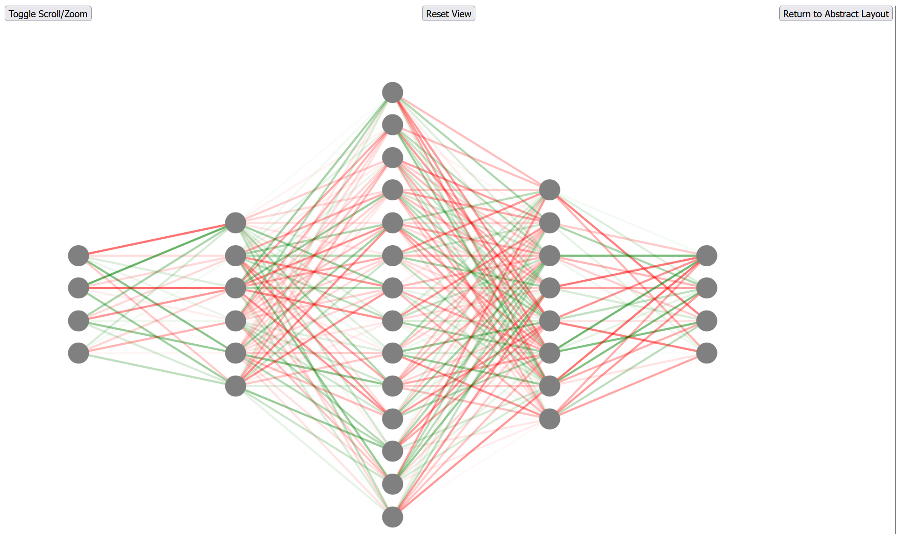
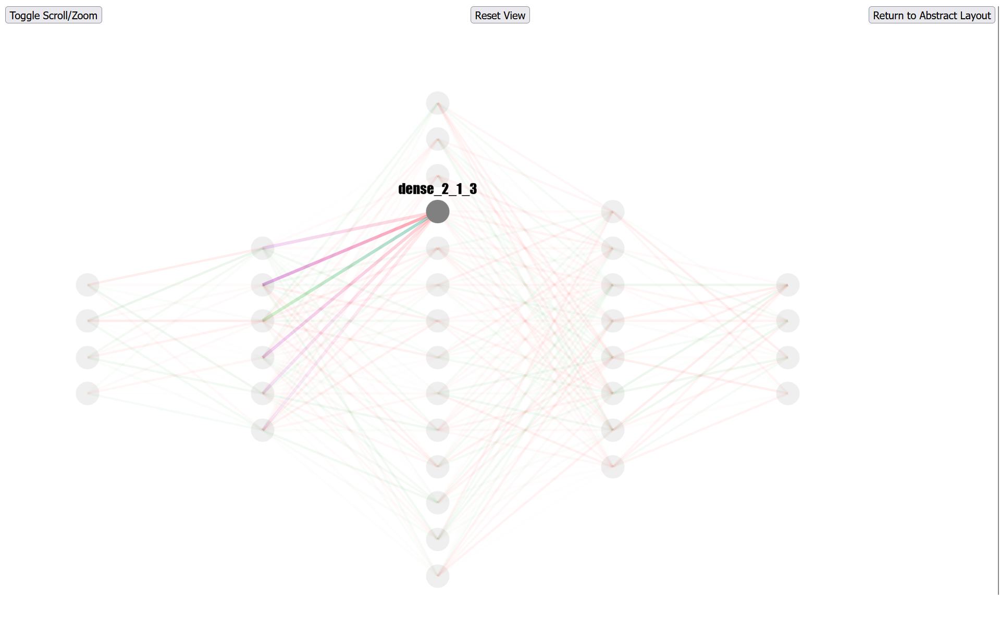
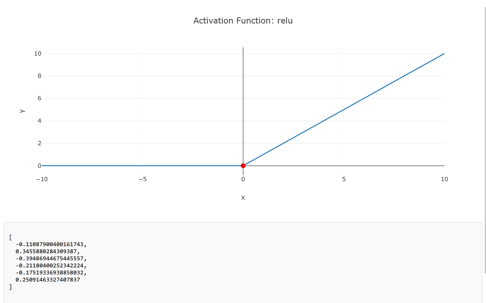

# NNVct
Neural Network Visualizer 

 NNVct can visualize any (supported) NN from specified .onnx file

Example of Abstract Layout

Focuced layout for user chosen layer with adjucent layers (2 to the left and 2 to the right)

User can move, hover, pan, zoom etc.

User can look at the insides of each* individual neuron

Currently NNVCt is limited to FFNNs, but the projects stucture allows further modifications and additions

*Input neurons are not supported yet

#### Setup

- install all libraries from requirements.txt
- run ./Application/app.py from root directory
- go to http://127.0.0.1:5000/abstractLayout
