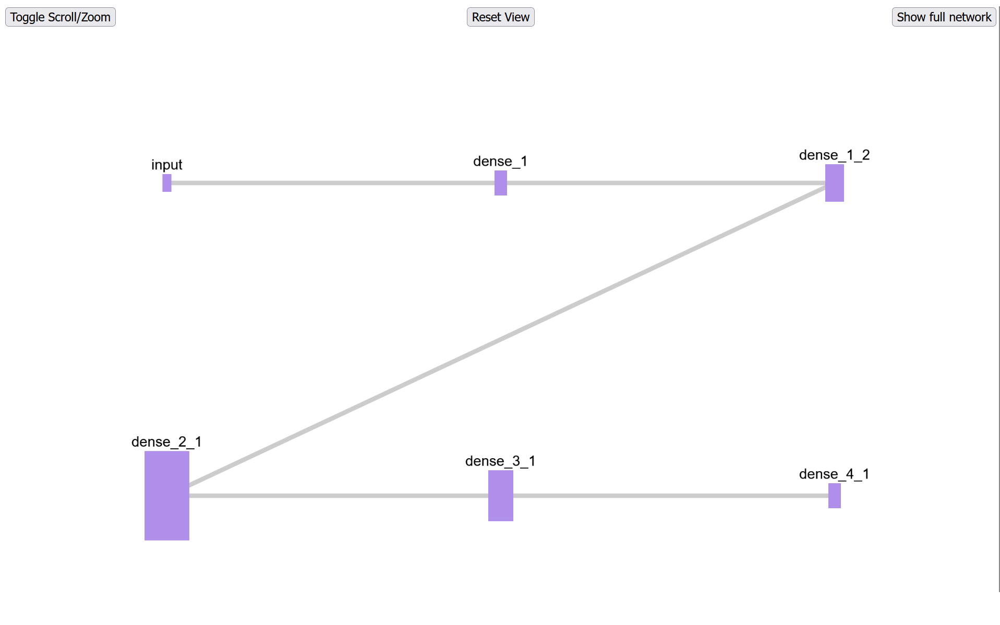

# NNVct
Neural Network Visualizer 

 NNVct can open any* (supported) nn in .onnx file

Abstract Layout of the Network

Focuced layout for the chosen layer with 4 adjucent layers (2 from left and 2 from right)

User can move, hover, pan, zoom etc.

User can look at the insides of each individual neuron

Currently NNVCt is limited to FFNNs, but the projects stucture allows further modifications and additions

#### Setup

- install all libraries from requirements.txt
- run ./Application/app.py from root directory
- go to http://127.0.0.1:5000/abstractLayout
